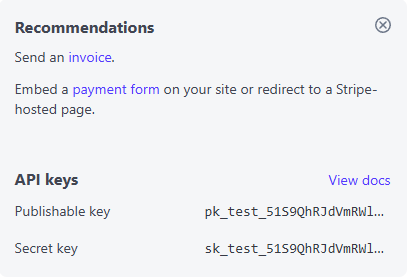
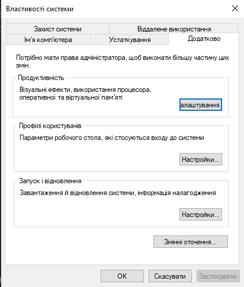
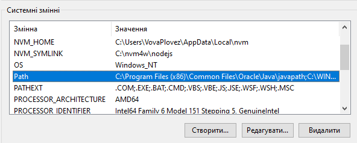
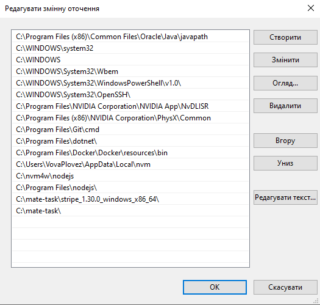
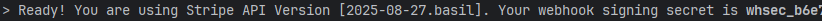

# Contributing  

## Installing Stripe CLI  

Go to stripe
👉 [Stripe](https://stripe.com/) 

Login or register

Add sandbox and copy your secret key to your env.



It looks like this:
sk_test_51S....


---

### 1. Download Stripe CLI  

Go to the release page:  
👉 [Stripe CLI v1.30.0 (GitHub Releases)](https://github.com/stripe/stripe-cli/releases/tag/v1.30.0)  

Download the `.exe` file, unpack it to a convenient location, and copy the path.  

  

---

### 2. Add Environment Variable (Windows)  

1. Press **Win + R**, type `sysdm.cpl`, and hit Enter.  
2. Go to **Advanced → Environment Variables**.  
     
     
3. Add the path to the Stripe CLI executable into the `Path` variable.  
     

Make sure to save your changes.  

---

### 3. Verify Installation  

Open **PowerShell** or **CMD** and run:  

```bash
stripe --version
```  

If you see a version number, Stripe CLI is installed successfully 🎉  

---

## Working with Stripe CLI  

### 1. Authenticate  

Log in to Stripe CLI with:  

```bash
stripe login
```  

This will open a browser window to connect your CLI with your Stripe account.  

---

### 2. Enable Webhook Listener  

To forward events from Stripe to your local server, run:  

```bash
stripe listen --forward-to http://127.0.0.1:8000/api/payment/webhook/
```  

Must be like this:


Don't forget to add webhook secret to env! (whsec_b6...)

---
